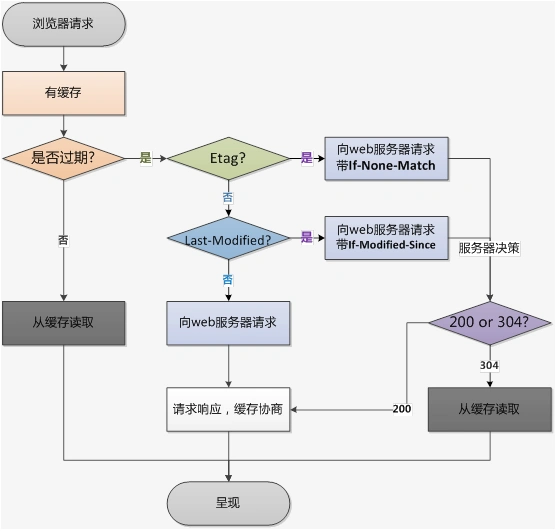

# HTTP缓存
## 缓存概述
缓存是一种保存资源副本并在下次请求时直接使用该副本的技术。当 web 缓存发现请求的资源已经被存储，它会拦截请求，返回该资源的拷贝，而不会去源服务器重新下载。

缓存的种类有很多,其大致可归为两类：私有与共享缓存。共享缓存存储的响应能够被多个用户使用。私有缓存只能用于单独用户。

- 私有缓存（浏览器缓存）

    私有缓存只能用于单独用户。浏览器缓存拥有用户通过 HTTP 下载的所有文档。这些缓存为浏览过的文档提供向后/向前导航，保存网页，查看源码等功能，可以避免再次向服务器发起多余的请求。它同样可以提供缓存内容的离线浏览。

- 共享缓存（代理缓存）

    共享缓存可以被多个用户使用。例如，ISP 或你所在的公司可能会架设一个 web 代理来作为本地网络基础的一部分提供给用户。这样热门的资源就会被重复使用，减少网络拥堵与延迟。

本文后续部分只讨论**浏览器缓存**

## 分类
根据是否需要重新向服务器发起请求来分类包括两种：**强制缓存** 和 **协商缓存**。

### 强制缓存
强制缓存规则下的流程：
1. 请求数据
2. 查询缓存数据库
   1. 若命中缓存且未失效，则直接返回数据
   2. 若未命中缓存或者缓存已失效，则向服务器请求数据和缓存规则，将两者同时存入缓存数据库

浏览器通过响应头中的两个字段判断强制缓存的失效与否

若命中，响应的状态码是 200

#### `Expires`：
代表该资源的过期时间。

Expires是HTTP1.0的产物，现在默认浏览器均默认使用HTTP 1.1，所以它的作用基本忽略。
    
但是很多网站还是对它做了兼容。它的值为服务端返回的到期时间，即下一次请求时，请求时间小于服务端返回的到期时间，直接使用缓存数据。

**问题**：
但有一个问题是到期时间是由服务端生成的，如果客户端时间跟服务器时间不一致，这就会导致缓存命中的误差。

#### `Cache-Control`
默认值为`private`。

规则如下：
1. max-age：用来设置资源（representations）可以被缓存多长时间，单位为秒；
2. s-maxage：和max-age是一样的，不过它只针对代理服务器缓存而言；
3. public：指示响应可被任何缓存区缓存；
4. private：只能针对个人用户，而不能被代理服务器缓存；
5. no-cache：强制客户端直接向服务器发送请求,也就是说每次请求都必须向服务器发送。服务器接收到请求，然后判断资源是否变更，是则返回新内容，否则返回304，未变更。
    > 这个很容易让人产生误解，使人误以为是响应不被缓存。实际上`Cache-Control: no-cache`是会被缓存的，只不过每次在向客户端（浏览器）提供响应数据时，缓存都要向服务器评估缓存响应的有效性。
6. no-store：禁止一切缓存（这个才是响应不被缓存的意思）。

**触发条件**：
要让浏览器走强制缓存对请求方式有一个要求: 在URL输入栏中输入然后回车/通过书签访问

### 协商缓存
协商缓存规则下的请求流程：
1. 从缓存数据库中获取缓存数据的标识
2. 请求服务器，验证缓存标识对应的数据是否失效
   1. 若缓存失效，则返回最新的数据和缓存标识
   2. 若缓存未失效，通知客户端缓存未失效

若命中，响应的状态码是 304

浏览器通过响应头中的如下字段来表明规则

#### `Last-Modified` / `If-Modified-Since`
- Last-Modified 是**由服务器发送**给客户端的HTTP请求头标签
- If-Modified-Since 则是**由客户端发送**给服务器的HTTP请求头标签

服务器响应请求时，会通过Last-ModifiedHTTP头告诉浏览器资源的最后修改时间，浏览器本地对资源缓存起来。

之后再请求的时候，会带上一个HTTP头 `If-Modified-Since`，这个值就是服务器上一次给的`Last-Modified`的时间。

服务器会拿着浏览器传过来的时间比对资源当前最后的修改时间，如果大于`If-Modified-Since`，则说明资源修改过了，浏览器不能再使用缓存，服务器重新一份完整的资源浏览器。否则浏览器可以继续使用缓存，并返回304状态码

#### `Etag` / `If-None-Match`
这一组字段的优先级高于 `Last-Modified` / `If-Modified-Since`。

Etag 相当于给资源生成了一个独一无二的标识，当资源被修改了，Etag就会改变。 作用和 Last-Modified 类似。

服务器响应请求时，通过 `Etag` HTTP头部告诉浏览器当前资源在服务器的唯一标识（生成规则由服务器决定）。

浏览器再次请求时，就会带上一个头 `If-None-Match`，这个值就是服务器上一次给的 `Etag` 的值。

服务器比对一下资源当前的 `Etag` 是否跟 `If-None-Match` 一致，不一致则说明资源修改过了，浏览器不能再使用缓存，否则浏览器可以继续使用缓存，并返回304状态码

## 流程总结

## 参考
- [5分钟看懂系列：HTTP缓存机制详解](https://segmentfault.com/a/1190000021716418)
- [HTTP 缓存](https://developer.mozilla.org/zh-CN/docs/Web/HTTP/Caching)
