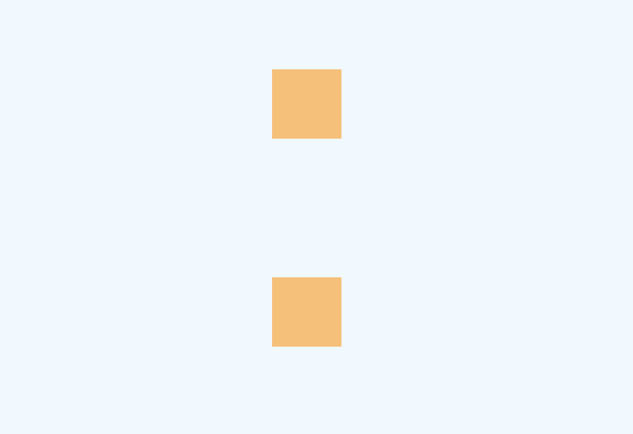

# CSS - BFC
## 定义
页面上的所有内容都是格式化上下文（formatting context）的一部分，或者是一个以特定方式显示的区域。块格式上下文（BFC）将根据块布局规则布局子元素。

BFC是一个完全独立的空间（布局环境），让空间里的子元素不会影响到外面的布局。

## 触发机制
触发BFC的机制有以下几条：
- 根元素，即`<html>`
- float 的值不为 none
- overflow 的值不为 visible
- display 的值为 inline-block、table-cell、table-caption
    > display：table也认为可以生成BFC，其实这里的主要原因在于Table会默认生成一个匿名的table-cell，正是这个匿名的table-cell生成了BFC
- position 的值为 absolute 或 fixed。
- 弹性元素（display 为 flex 或 inline-flex 元素的直接子元素）
- 网格元素（display 为 grid 或 inline-grid 元素的直接子元素）


以上条件常见的CSS属性值有这几条：
```css
{
    overflow: hidden;
    position: absolute;
    position: fixed;
    display: inline-block;
    display: table-cell;
    display: flex;
}
```

## 布局规则
- BFC就是一个块级元素，块级元素会在垂直方向一个接一个的排列
- BFC就是页面中的一个隔离的独立容器，容器里的标签不会影响到外部标签
- 垂直方向的距离由margin决定，属于同一个BFC的两个相邻的标签外边距会发生重叠
- 计算BFC的高度时，浮动元素也参与计算
- 每个元素的左外边距与包含块的左边界相接触（从左向右），即使浮动元素也是如此。（这说明BFC中子元素不会超出他的包含块，而position为absolute的元素可以超出他的包含块边界）
- BFC的区域不会与 float 的元素区域重叠

## 应用
### 防止 margin 重叠（塌陷）
默认情况下，上下 margin 会重叠。若两个元素设为BFC，则边距不会重叠。如下例所示：



```html
<div class="container">
    <div class="inner orange"></div>
    <div class="bfc">
        <div class="inner orange"></div>
    </div>
</div>
```
```css
body {
    background-color: aliceblue;
}

.orange {
    background-color: rgb(255, 190, 110);
}

div.bfc {
    overflow: hidden;
}

.inner {
    width: 50px;
    height: 50px;

    margin: 50px;
}
```
上例中两个`<div class="inner">`不属于同一个BFC，因此 margin 没有重叠。如果只是给两个相邻元素添加`overflow: hidden`，则他们虽然会在内部形成不同BFC，但仍然属于同一个共同的BFC，边距还是会重叠。

## 防止使用Float使元素脱离文档流，导致高度塌陷
如下例所示，给橙色的div设置了float属性后，该元素脱离了文档流，导致`<div class="container">`的高度变为 0，背景色无法显示。
```html
<div class="container">
    <div class="inner orange"></div>
</div>
```
```css
div.container {
    background-color: teal;
}

.orange {
    background-color: orange;
}

.inner {
    width: 50px;
    height: 50px;

    margin: auto;
    float: left;
}
```

效果如图


使用上文提到的任意一种方法给`<div class="container">`设置BFC，如`overflow: hidden`，然后容器元素的高度就会将浮动元素也纳入计算，效果如下图：


## 自适应两栏布局
```html
<div class="container">
    <div class="aside teal"></div>
    <div class="main orange"></div>
</div>
```
```css
.container {
    height: 200px;
}

.teal {
    background-color: teal;
}

.orange {
    background-color: orange;
}

.aside {
    width: 100px;
    height: inherit;

    float: left;
}

.main {
    height: inherit;
    /* 使 main 成为一个BFC */
    overflow: hidden;
}
```
当 main 生成BFC后，这个新的BFC不会与浮动的 aside 重叠。因此会根据包含块的宽度，和 aside 的宽度，自动变窄。

效果如下图：


## 参考
- [面试官：请说说什么是BFC？大白话讲清楚](https://juejin.cn/post/6950082193632788493)
- [史上最全面、最透彻的BFC原理剖析](https://juejin.cn/post/6844903496970420237)
