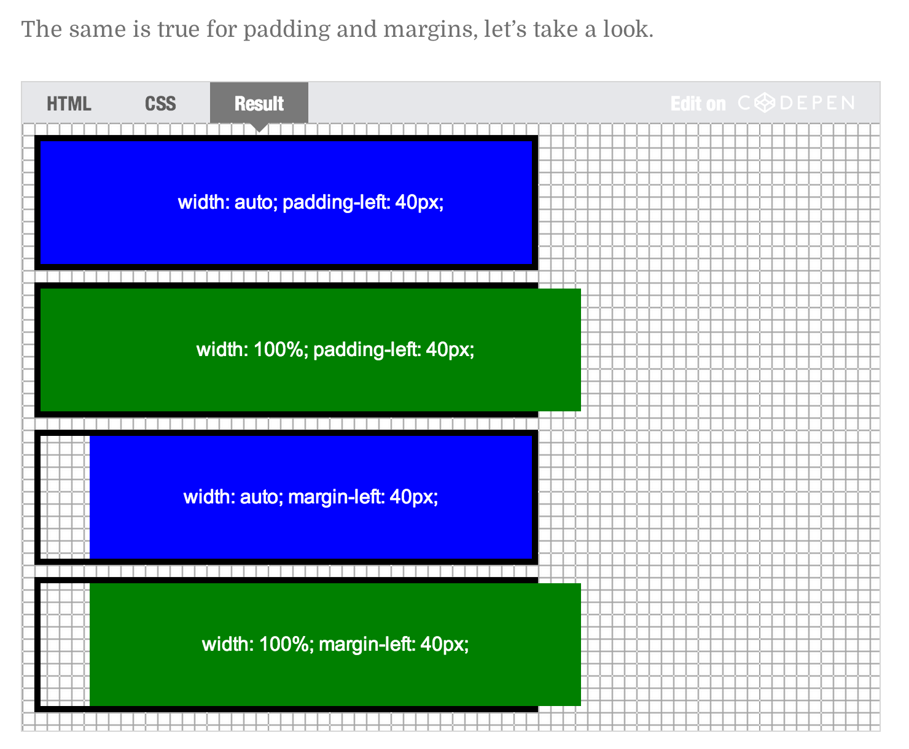

# CSS基础 - 盒子模型
## 定义
在 CSS 中任何元素都可以看成是一个盒子，而一个盒子是由 4 部分组成的：内容（content）、内边距（padding）、边框（border）和外边距（margin）。

盒模型有 2 种：标准盒模型和 IE 盒模型，本别是由 W3C 和 IExplore 制定的标准。

标准盒模型认为：
盒子的实际尺寸 = 内容（设置的宽/高） + 内边距 + 边框

IE 盒模型认为：
盒子的实际尺寸 = 设置的宽/高 = 内容 + 内边距 + 边框

```css
.box {
    width: 200px;
    height: 200px;
    padding: 10px;
    border: 1px solid #eee;
    margin: 10px;
}
```

标准盒模型下， .box 元素内容的宽度就为 200px，而实际的宽度则是 

width + padding-left + padding-right + border-left-width + border-right-width = 200 + 10 + 10 + 1 + 1 = 222。

**标准盒模型下，内容宽度一定，增加边距和边框会 增加 整个元素的尺寸**

而 IE 盒模型下，内容的真实宽度则是 

width - padding-left - padding-right - border-left-width - border-right-width = 200 - 10 - 10 - 1 - 1 = 178。

**IE盒模型下，整个元素的宽度一定，增加边距和边框会 缩小 内容的尺寸**

在 CSS3 中新增了一个属性 `box-sizing`，允许开发者来指定盒子使用什么标准，它有 2 个值：
- `content-box`：标准盒模型；
- `border-box`：IE 盒模型；

## margin
外边距是盒子周围一圈看不到的空间。它会把其他元素从盒子旁边推开。 外边距属性值可以为正也可以为负。设置负值会导致和其他内容重叠。无论使用标准模型还是替代模型，外边距总是在计算可见部分后额外添加。

给 margin 传入的参数数量不同，代表的效果也不同：
- 1 个参数：代表上下左右的 mragin
- 2 个参数：第一个代表上下，第二个代表左右
- 3 个参数：第一个代表上，第二个代表左右，第三个代表下
- 4 个参数：按序分别代表上，右，下，左

**padding 同理**

### 属性值
可以取固定值（px）或者相对值（vh，vw，em，rem）以及百分比。

margin 的百分比值取的是**父容器的宽度**的百分比。

**padding 的百分比取值同理**

### 行内元素 
margin-top/margin-bottom对于上下元素无效，margin-left/margin-right有效

### 块级元素
对于相邻的块级元素margin-top和margin-bottom两者叠加按照一定的规则：
- 都是正数 `margin` 值取最大值
- 都是负数 `margin` 值取最小值
    > margin 取负数时会往反方向拓展。例如，设置了 `margin-top: -100px` ，则对应的元素边距相比父元素会向上拓展 100px
- 两者正负相反，`margin` 值取两者之和

### auto
当元素的左右 margin 设为 auto 时，它将会被设置相同的左右边距，结果是这个元素被水平居中了。

元素的上下 margin 设为 auto 时，值会变成 0。因此不能用这种办法垂直居中元素。

## padding
内边距位于边框和内容区域之间，通常用于将内容推离边框。

与外边距不同，padding 不能为负数值。应用于元素的任何背景都将显示在内边距后面。

**padding 没有 auto 这个选项**

## 元素默认宽高
在默认情况下，height 和 width 的值为 auto，两者有不同的表现。

min/max-width/height 会优先于 width/height 生效。

### width
width 用来设置**内容区域**的宽度，不是整个元素的宽度（即带上内外边距和边框）

默认值为 auto ，意味着元素会占满它的包含块（containing block）的宽度。如果元素还有额外的内外边距，则内容宽度会相应减少，元素的**盒子宽度**保持为父元素的**内容宽度**。

如果设为 auto，则元素宽度会变为它的包含块的内容宽度（即width）再加上额外的元素内外边距。

与 width: 100% 对比如下图所示：


### height
与 width 相同，height 用来设置**内容区域**的高度。

默认值为 auto ，等于元素的内容高度，如果这个块级元素没有内容则会变为 0。

如果设为 100%，则元素的内容高度会和父元素保持一致

## 获取元素的宽高
有如下HTML和CSS
```html
<div id="test">
    test
</div>
```

```css
div#test {
    height: 50px;
    width: 50px;
}
```
使用如下JS代码无法获取到元素的宽高
```js
let test = document.getElementById("test");
console.log(test.style.height);
// ""
```

原因是 `element.style.height` 这样的方式仅能获取到内联样式。对于外部样式，应该参考以下方式：
```js
let test = document.getElementById("test");

// 方法一，getComputedStyle
window.getComputedStyle(test).height; // "50px"
// 方法二，clientHeight/clientWidth 属性
// 获取到的是内容区域加上下 padding 的大小
test.clientHeight; // 50
```

除此之外，通过元素的`offsetHeight、offsetWidth`可以获取到包含 padding 和 margin 的尺寸值。

## 参考
- [Everything About Auto in CSS
](https://ishadeed.com/article/auto-css/)
