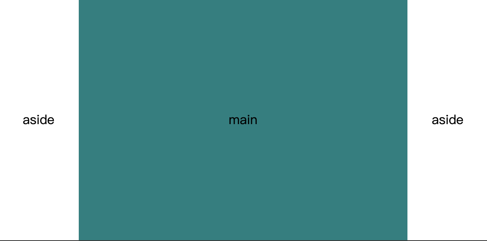

# CSS - 双栏，三栏布局
## 双栏布局
样式：边栏定宽，主栏自适应

### 1. float + overflow（BFC 原理）
```html
<div>
    <aside></aside>
    <main></main>
</div>
```

```css
aside {
    float: left;
    width: 200px
}

main {
    overflow: hidden
}
```

### 2. float + margin
```html
<div>
    <!-- aside 必须在前，否则 aside 会在下一行 -->
    <aside></aside>
    <main></main>
</div>
```

```css
aside {
    float: left;
    width: 200px;
}

main {
    margin-left: 200px;
}
```

### 3. flex
```html
<div class="layout">
    <aside></aside>
    <main></main>
</div>
```

```css
.layout {
    display: flex;
}

aside {
    width: 200px;
}

main {
    flex: 1;
}
```

### 4. grid
```html
<div class="grid">
    <aside></aside>
    <main></main>
</div>
```

```css
.grid {
    display: grid;
    grid-template-columns: 200px auto;
}
```

## 三栏布局
样式：左右两侧栏定宽，主栏自适应

### 1. 圣杯布局
样式如图


flex 实现方法如下所示
```html
<body>
  <header>...</header>
  <div class="main">
    <nav class="left">...</nav>
    <main class="content">...</main>
    <aside class="aside">...</aside>
  </div>
  <footer>...</footer>
</body>
```

```css
body {
  display: flex;
  min-height: 100vh;
  flex-direction: column;
}

header,
footer {
  /* flex设为 1 会导致header和主体部分等高 */
  flex: 1;
}

div.main {
  display: flex;
  flex: 1;
}

main.content {
  flex: 1;
}

.left .right {
  /* 两个边栏的宽度设为12em */
  flex: 0 0 12em;
}
```

### 2. 双飞翼布局
```html
<div class="wings">
    <main>
        <div class="inner">main</div>
    </main>
    <aside class="left">aside</aside>
    <aside class="right">aside</aside>
</div>
```

```css
/* 包含中间栏的浮动容器 */
main {
  float: left;
  width: 100%;
}

/* 中间栏的左右边距与左右栏的宽度保持一致 */
.inner {
  margin: 0 150px;
}

/* 左栏的-100%左边距会将其拉到上一个浮动元素左对齐的位置 */
.left {
  margin-left: -100%;
  width: 150px;
}
/* 右栏的负左边距将其拉到上一行，设置为元素宽度则刚好右对齐 */
.right {
  float: left;
  margin-left: -150px;
  width: 150px;
}
```


### 3. float + overflow（BFC 原理）
```html
<div>
    <aside class="left">aside</aside>
    <aside class="right">aside</aside>
    <main class="hidden">main</main>
</div>
```

```css
.left {
  float: left;
  width: 150px;
}

.right {
  float: right;
  width: 150px;
}
/* BFC 不会与 float 元素重叠 */
.hidden {
  overflow: hidden;
}
```


### 4. flex
效果如图



```html
<section class="layout">
  <aside>aside</aside>
  <main>main</main>
  <aside>aside</aside>
</section>
```

```css
.layout {
  display: flex;
}

aside {
  width: 200px;
}

main {
  flex: 1;
}
```

### 5. grid
```html
<div class="container">
    <div></div>
    <div></div>
    <div></div>
</div>
```
```css
.container {
    display: grid;
    grid-template-columns: 200px auto 200px;
}
```
