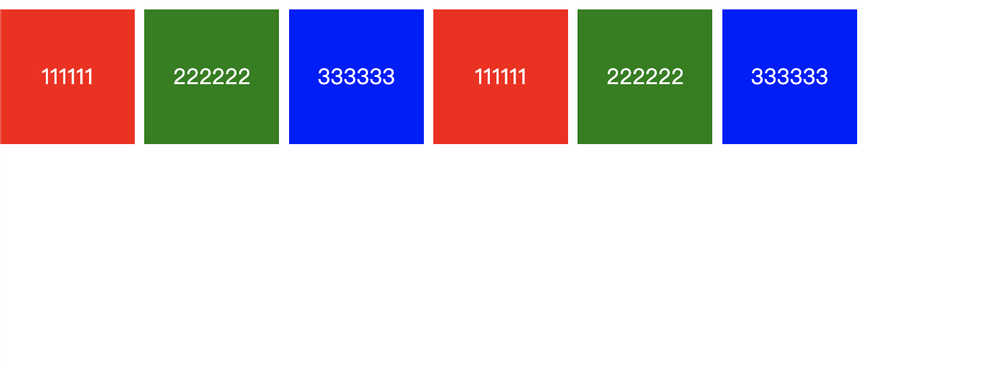
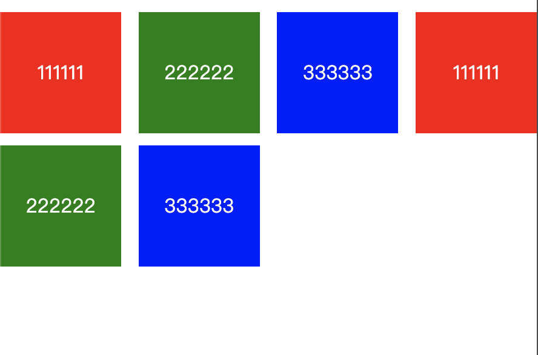

# CSS - `display`
## 定义
display 属性规定元素应该生成的框的类型。

主要属性一览
```css
/* CSS 1 */
display: none;
display: inline;
display: block;
display: list-item;

/* CSS 2.1 */
display: inline-block;

display: table;
display: inline-table;
display: table-cell;
display: table-column;
display: table-column-group;
display: table-footer-group;
display: table-header-group;
display: table-row;
display: table-row-group;
display: table-caption;
/* CSS 2.1 */

/* CSS 3 */
display: inline-list-item;
display: flex;
display: box;
display: inline-flex;

display: grid;
display: inline-grid;

display: ruby;
display: ruby-base;
display: ruby-text;
display: ruby-base-container;
display: ruby-text-container;
/* CSS 3 */

/* Global values */
display: inherit;
display: initial;
display: unset;
```

## 属性
### none

none 是 CSS 1 就提出来的属性，将元素设置为 none 的时候既不会占据空间，也无法显示，相当于该元素不存在。

该属性可以用来改善重排与重绘，同时我也经常用它来做模态窗等效果。

### inline
inline也是 CSS 1 提出的属性，它主要用来设置行内元素属性，设置了该属性之后设置高度、宽度都无效，同时 text-align 属性设置也无效，但是设置了 line-height 会让 inline 元素居中

### block
设置元素为块状元素，如果不指定宽高，默认会继承父元素的宽度，并且独占一行，即使宽度有剩余也会独占一行，高度一般以子元素撑开的高度为准，当然也可以自己设置宽度和高度。

> 如何设置宽高为屏幕宽高的一个 div ？使用块级元素继承高度的原理。下例中 div 高度继承自 body，body 继承自 html，而 html 的高度继承自浏览器窗口。

```html
<!DOCTYPE html>
<html>
  <head>
    <style>
      html{
        height: 100%;
      }
      body{
        height: 100%;
        padding: 0;
        margin:0;
      }
      .main{
        background: grey;
        width: 100%;
        height: 100%;
      }
    </style>
  </head>
  <body>
    <div class="main">这个div会刚好占满整个窗口</div>
  </body>
</html>
```

### list-item
此属性默认会把元素作为列表显示，要完全模仿列表的话还需要加上 list-style-position，list-style-type。如下例所示
```html
<!DOCTYPE html>
<html>
  <head>
    <style>
      div{
        padding-left:30px;
      }
      
      span{ 
        display:list-item;
        list-style:disc outside none;
      }
    </style>
  </head>
  <body>
  <div>
    <span>111111</span>
    <span>222222</span>
    <span>333333</span>
  </div>
  </body>
</html>
```

效果类似 li。

### inline-block
CSS 2.1 新增的属性。 inline-block 既具有 block 的宽高特性又具有 inline 的同行元素特性。
通过 inline-block 结合 text-align: justify 还可以实现固定宽高的列表两端对齐布局。
```html
<!DOCTYPE html>
<html>
<head>
  <meta charset="utf-8">
  <title>JS Bin</title>
  <style>
    body{
      margin:0;
      padding:0; 
    }
    .main{
      text-align:justify;
    }
    .col{ 
      display: inline-block;
      margin-top:10px;
      width:100px;
      height: 100px;
      text-align: center;
      line-height: 100px;
      color: #fff;
    }
    .col1{
      background: red;
    }
    .col2{
      background: green;
    }
    .col3{
      background: blue;
    }
    .fix{
      height:0; 
      padding:0; 
      overflow:hidden;
    }
  </style>
</head>
<body>
<div class="main">
  <div class="col col1">111111</div>
  <div class="col col2">222222</div>
  <div class="col col3">333333</div>
  <div class="col col1">111111</div>
  <div class="col col2">222222</div>
  <div class="col col3">333333</div>
  <div class="col fix">&nbsp;</div>
  <div class="col fix">&nbsp;</div>
  <div class="col fix">&nbsp;</div>
  <div class="col fix">&nbsp;</div>
  <div class="col fix">&nbsp;</div>
</div>
</body>
</html>
```
效果如下图所示:
宽度足够时按照固定边距行内排列

宽度不足时自动换行并保持元素间距相同


**注意**：inline-block会形成一个BFC

### table
此元素会作为块级表格来显示（类似table），表格前后带有换行符。

display:table 的CSS声明能够让一个HTML元素和它的子节点像table元素一样。使用基于表格的CSS布局，使我们能够轻松定义一个单元格的边界、背景等样式，而不会产生因为使用了table那样的制表标签所导致的语义化问题。

示例如下，使用 display: table 样式实现三栏布局
```html
<!DOCTYPE html>
<html>
<head>
  <meta charset="utf-8">
  <title>JS Bin</title>
</head>
<body>
<div class="main">
  <div class="tr tr1">
    <div class="td">head1</div>
    <div class="td">head2</div>
    <div class="td">head3</div>
  </div>
  <div class="tr tr2">
    <div class="td">123</div>
    <div class="td">123</div>
    <div class="td">123</div>
  </div>
</div>
</body>
</html>
```

```css
.main{
  display: table;
  width:100%;
  border-collapse: collapse;/*为表格设置合并边框模型：*/
}
.tr{
  display: table-row;
  border-color: inherit;
}
.tr1 .td{
  height: 50px;
  vertical-align: middle;
}
.td{
  display: table-cell;
  border: 1px solid;
}
.td:nth-of-type(1){
  width: 100px;
}
.td:nth-of-type(3){
  width: 100px;
}
```

### flex
参见 [CSS - Flex](Flexbox.md)
