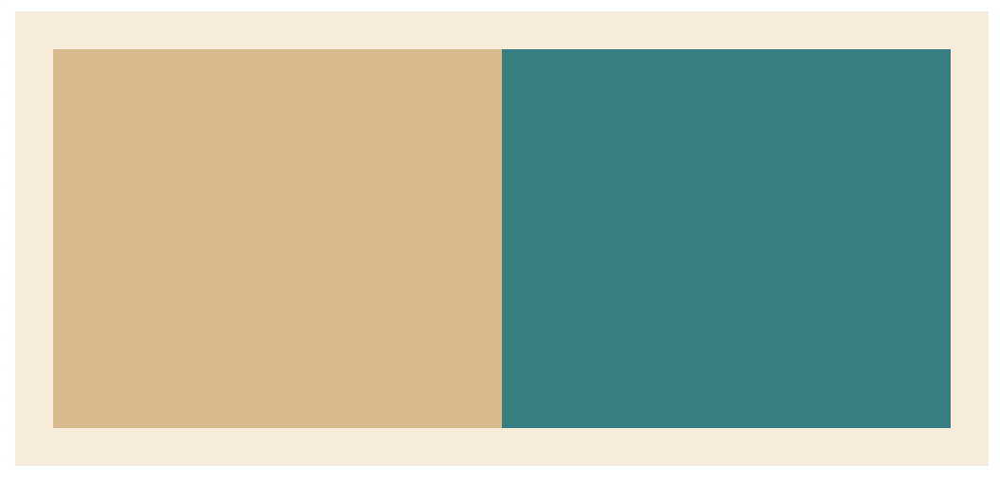

# CSS基础 - 浮动元素
## 定义
float CSS属性指定一个元素应沿其容器的左侧或右侧放置，允许文本和内联元素环绕它。该元素从网页的正常流动(文档流)中移除，尽管仍然保持部分的流动性（与绝对定位相反）。

## 属性值
- left — 将元素浮动到左侧。
- right — 将元素浮动到右侧。
- none — 默认值, 不浮动。
- inherit — 继承父元素的浮动属性。

## 浮动元素的定位
当一个元素浮动之后，它会被移出正常的文档流，然后向左或者向右平移，一直平移直到碰到了所处的容器的边框，或者碰到**另外一个浮动的元素**。

如下例所示，如果没有指定 float 属性，则三个 `<div>` 会按照默认的块级元素排列规则，从上到下排列。而指定 `float: left` 后，三个 div 方块会从左到右排列。

如果还有更多的正方形这样浮动，它们会继续向右堆放，直到填满容器一整行，之后换行至下一行。
```html
<div class="layout">
    <div class="center">1</div>
    <div class="center">2</div>
    <div class="center">3</div>
</div>
```
```css
div.layout {
    background-color: aliceblue;
    width: 800px;
    height: 500px;
}

div.center {
    background-color: chocolate;
    width: 100px;
    height: 100px;

    margin: 0 20px;
    float: left;
}
```
## 浮动带来的问题
1. 父元素的高度无法被撑开，影响与父元素同级的元素
2. 与浮动元素同级的非浮动元素（内联元素）会跟随其后
3. 若非第一个元素浮动，则该元素之前的元素也需要浮动，否则会影响页面显示的结构。


## 清除浮动
对于以上问题的解决方案：
1. 父元素设置高度
2. 最后一个浮动元素后加一个空 div ，并使用 `clear: both`
3. 包含浮动元素的父标签添加样式 `overflow: hidden` 或 `auto`。

使用 clear 属性可以清除浮动效果，可选值如下：
- left：
- right：
- both：

## 宽度问题
如下例所示：
```html
<main class="container">
    <aside class="left"></aside>
    <aside class="right"></aside>
</main>
```

```css
main.container {
    height: 200px;
    padding: 20px 20px;
    background-color: antiquewhite;
}

aside {
    height: inherit
}

.left {
    background-color: burlywood;
    float: left;
    width: 50%;
    padding: 0 10px;

    /** box-sizing: border-box; */
}

.right {
    background-color: teal;
    float: right;
    width: 50%;
}
```

左侧float元素由于存在内边距，按照默认标准盒模型计算宽度会超出50%，导致右侧浮动元素换行，效果如下：


而解决办法是将该float元素的宽度计算方法改成IE盒模型，不加入内边距，即注释中的一行 `box-sizing: border-box`。修改后效果如下：

