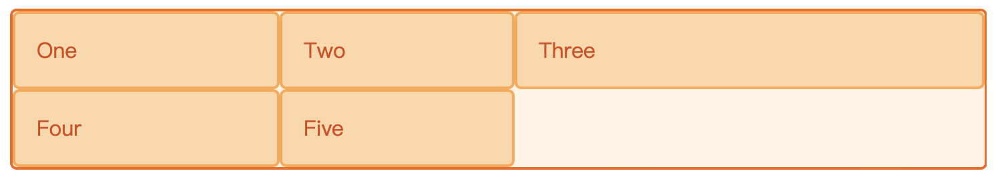
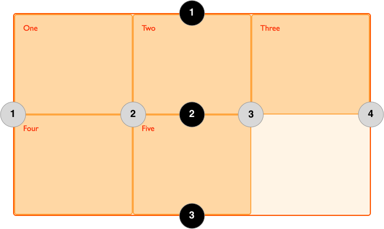
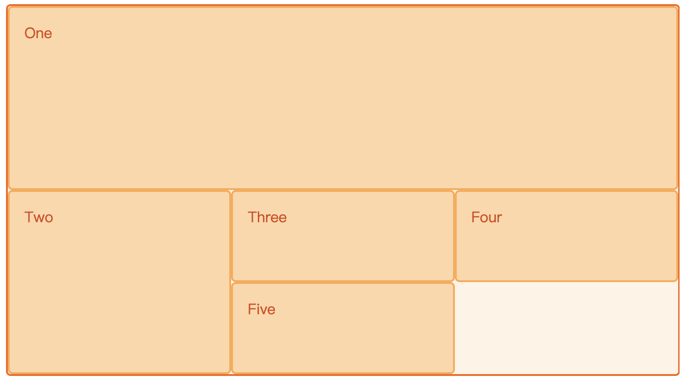

# CSS - grid 布局

## 网格轨道
通过 grid-template-columns 和 grid-template-rows 属性来定义网格中的行和列。这些属性定义了网格的轨道。一个网格轨道就是网格中任意两条线之间的空间。

创建了一个网格，包含了三个200像素宽的列轨道，示例如下：
```html
<div class="wrapper">
   <div>One</div>
   <div>Two</div>
   <div>Three</div>
   <div>Four</div>
   <div>Five</div>
</div>
```

```css
.wrapper {
  display: grid;
  grid-template-columns: 200px 200px 200px;
}
```

效果如下：


### fr 单位
fr单位代表网格容器中可用空间的一等份。对于上例中的HTML，下面的CSS可以将容器空间均分为三列。
```css
.wrapper {
  display: grid;
  grid-template-columns: 1fr 1fr 1fr;
}
```

效果如下：


fr 也可与 绝对长度值混用，如下第一个轨道是500像素，这个固定宽度被从可用空间中取走。剩下的空间被分为三份，按比例分配给了两个弹性尺寸轨道。
```css
.wrapper {
  display: grid;
  grid-template-columns: 500px 1fr 2fr;
}
```

效果如下：



### repeat()
有着多轨道的大型网格可使用 repeat() 标记来重复部分或整个轨道列表。

以下两种写法等价：
```css
{
  grid-template-columns: 1fr 1fr 1fr;
  grid-template-columns: repeat(3, 1fr);
}
```

也可以和 fr 以及绝对数值混用，如下例所示：
```css
.wrapper {
  display: grid;
  grid-template-columns: 20px repeat(6, 1fr) 20px;
}
```

### 显式网格和隐式网格
显式网格包含了你在 grid-template-columns 和 grid-template-rows 属性中定义的行和列。

隐式网格中用 grid-auto-rows 和 grid-auto-columns 属性来定义一个设置大小尺寸的轨道。

如下例所示，创建的网格有三列，每行高 200 px。
```html
<div class="wrapper">
   <div>One</div>
   <div>Two</div>
   <div>Three</div>
   <div>Four</div>
   <div>Five</div>
</div>
```

```css
.wrapper {
  display: grid;
  grid-template-columns: repeat(3, 1fr);
  grid-auto-rows: 200px;
}
```

## 网格线
通过网格线可以跨行或跨列定位元素。

使用 grid-column-start , grid-column-end , grid-row-start 和 grid-row-end 属性来指定每个网格对齐的网格线。

网格线为构造网格的边框线和分割线，默认从上到下，从左到右。如下图所示。



下例通过定义网格线，构造了具有跨行和跨列的网格

```html
<div class="wrapper">
   <div class="box1">One</div>
   <div class="box2">Two</div>
   <div class="box3">Three</div>
   <div class="box4">Four</div>
   <div class="box5">Five</div>
</div>
```

```css
.wrapper {
    display: grid;
    grid-template-columns: repeat(3, 1fr);
    grid-auto-rows: 100px;
}
.box1 {
    grid-column-start: 1;
    grid-column-end: 4;
    grid-row-start: 1;
    grid-row-end: 3;
}
.box2 {
    grid-column-start: 1;
    grid-row-start: 3;
    grid-row-end: 5;
}
```

效果如下图所示



## 网格间距
在两个网格单元之间的 网格横向间距 或 网格纵向间距 可使用 grid-column-gap 和 grid-row-gap 属性来创建，或者直接使用两个合并的缩写形式 grid-gap 。
