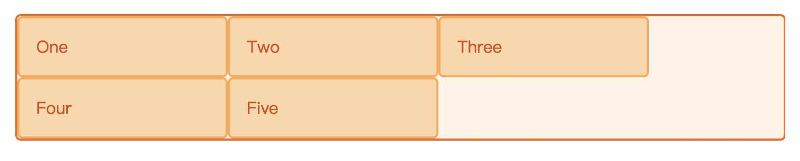
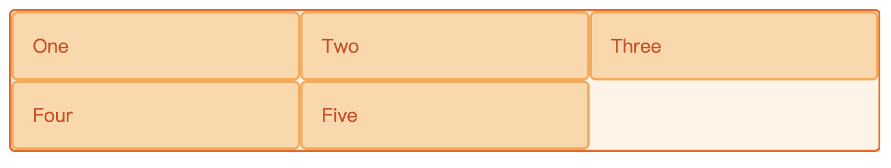

# CSS - grid 布局

## 网格轨道
通过 grid-template-columns 和 grid-template-rows 属性来定义网格中的行和列。这些属性定义了网格的轨道。一个网格轨道就是网格中任意两条线之间的空间。

创建了一个网格，包含了三个200像素宽的列轨道，示例如下：
```html
<div class="wrapper">
   <div>One</div>
   <div>Two</div>
   <div>Three</div>
   <div>Four</div>
   <div>Five</div>
</div>
```

```css
.wrapper {
  display: grid;
  grid-template-columns: 200px 200px 200px;
}
```

效果如下：


## fr 单位
fr单位代表网格容器中可用空间的一等份。对于上例中的HTML，下面的CSS可以将容器空间均分为三列。
```css
.wrapper {
  display: grid;
  grid-template-columns: 1fr 1fr 1fr;
}
```

效果如下：



TODO: