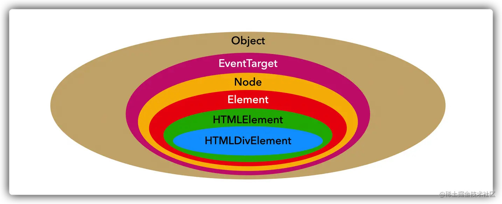

# HTML基础 - DOM
文档对象模型（Document Object Model），简称 DOM，将所有页面内容表示为可以修改的对象。


`document` 对象是页面的主要“入口点”。我们可以使用它来更改或创建页面上的任何内容。

## DOM 数据类型
### Node
所有DOM节点类型都实现了 Node 接口。每个节点都有 nodeType 属性，表示该节点的类型。

### Document
当一个成员返回 document 对象 （例如，元素的 ownerDocument 属性返回它所属于 document ) ，这个对象就是root document 对象本身。

表示整个HTML页面，是一个全局对象

### Element
element 表示XML或HTML 元素，对外暴露出访问元素标签名、子节点和属性的能力。

element类型有以下特征：
- nodeType 等于 1;
- nodeName 值为元素的标签名;
- nodeValue 值为 null;
- parentNode 值为 Document 或 Element 对象;
- 子节点可以是 Element、Text、Comment、ProcessingInstruction、CDATASection、EntityReference 类型。

### Text
包含按字面解释的纯文本，也可能包含转义后的 HTML 字符，但不含 HTML 代码

特征如下：
- nodeName 值为"#text";
- nodeValue 值为节点中包含的文本;
- parentNode 值为 Element 对象;

### NodeList
NodeList 是一个数组，如从 `document.getElementsByTagName()` 方法返回的就是这种类型。 

nodeList 中的条目由通过下标有两种方式进行访问：
- `list.item(1)`
- `list[1]`


两种方式是等价的，第一种方式中 item() 是 nodeList 对象中的单独方法。 后面的方式则使用了经典的数组语法来获取列表中的第二个条目。

### Attribute


## 节点类型的关系



`getElementById` 获取到的既是 Node 也是 Element，因为 Element 继承于 Node。

从而也可以得出一个结论：**Element 一定是 Node，但 Node 不一定是 Element。**

所以：Element 可以使用 Node 的所有方法。

## 访问节点
若访问一个DOM节点的结果为`null`，则该DOM节点不存在。

### 最顶层节点
最顶层的树节点可以直接作为 document 的属性来使用：

- `<html>` = `document.documentElement`

    最顶层的 document 节点是 document.documentElement。这是对应 `<html>` 标签的 DOM 节点。
- `<body>` = `document.body`
    
    另一个被广泛使用的 DOM 节点是 `<body>` 元素 — document.body。

    脚本无法访问在运行时不存在的元素。

    如果一个脚本是在 `<head>` 中，那么脚本是访问不到 document.body 元素的，因为浏览器还没有读到它。如下例
    ```html
    <html>
      <head>
        <script>
          // null，这里目前还没有 <body>
          alert( "From HEAD: " + document.body ); 
        </script>
      </head>

      <body>
      </body>
    </html>
    ```

- `<head>` = `document.head`
    
    `<head>` 标签可以通过 document.head 访问。

### 子节点
`childNodes` 集合列出了所有子节点，包括文本节点。使用方法为 `parentNode.childNodes
`

// TODO: note marker