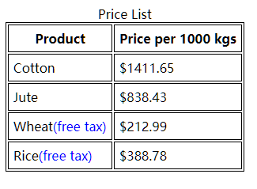

# HTML 的 data-* 属性

data-* 属性可以在 HTML 元素中存储额外的信息。

## 语法
在元素上以data-开头的属性为数据属性

```html
<article
  id="electriccars"
  data-columns="3"
  data-index-number="12314"
  data-parent="cars">
...
</article>
```

## JS 读取数据
有两种方法，使用 `getAttribute` 方法传入完整属性名获取对应的值，或者使用 `dataset` 对象获取数据属性。示例如下：

```js
var article = document.querySelector('#electriccars');

article.dataset.columns // "3"
article.dataset.indexNumber // "12314"
article.dataset.parent // "cars"
```

## CSS 读取数据
使用 attr() 函数，示例如下：
```css
article::before {
  content: attr(data-parent);
}
```

## 用法示例
在表格的表头部分为免税商品显式个蓝色标记
```html
<table>
    <caption>Price List</caption>
    <thead>
        <th>Product</th>
        <th>Price per 1000 kgs</th>
    </thead>
    <tbody>
        <tr data-tax-free="false">
            <td>Cotton</td>
            <td>$1411.65</td>
        </tr>
        <tr data-tax-free="false">
            <td>Jute</td>
            <td>$838.43</td>
        </tr>
        <tr data-tax-free="true">
            <td>Wheat</td>
            <td>$212.99</td>
        </tr>
        <tr data-tax-free="true">
            <td>Rice</td>
            <td>$388.78</td>
        </tr>
    </tbody>
</table>
```

```css
table,
th,
td {
    border: 1px solid black;
}

th,
td {
    padding: 6px;
}

tr[data-tax-free="true"] > td:first-child:after {
    content: "(free tax)";
    color: blue;
}
```

效果如下所示：

