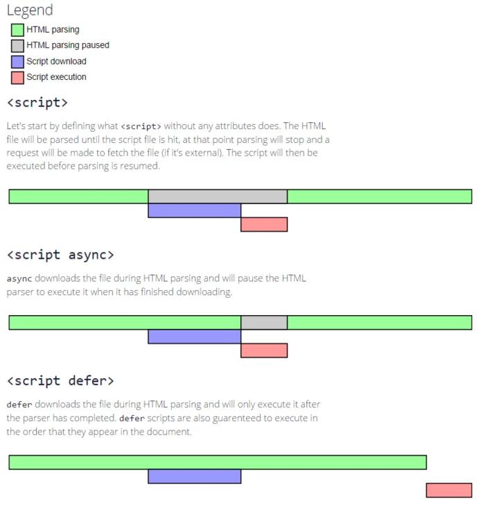
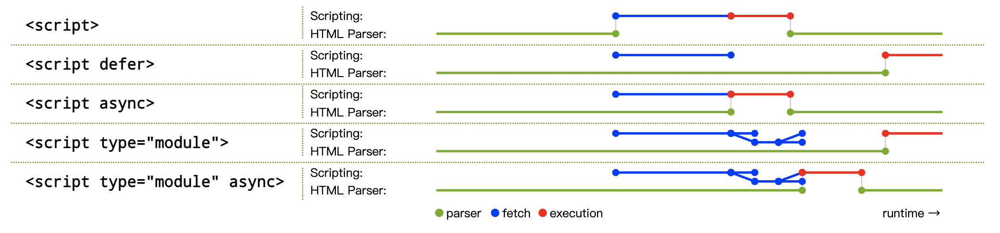

# `<script>`标签
`<script>`标签用来引入JavaScript代码

## 属性
- async：可选。HTML5新增。

    表示应该立即下载脚本，但不应妨碍页面中的其他操作，比如下载其他资源或等待加载其他脚本。只对**外部脚本文件**有效。

- charset：可选。

    表示通过 src 属性指定的代码的字符集。由于大多数浏览器会忽略它的值，因此这个属性很少有人用。

- defer：可选。

    表示脚本可以延迟到文档完全被解析和显示之后再执行。只对外部脚本文件有效。IE7 及更早版本对嵌入脚本也支持这个属性。

- language：已废弃。

    原来用于表示编写代码使用的脚本语言（如 JavaScript 、 JavaScript1.2 或 VBScript ）。大多数浏览器会忽略这个属性，因此也没有必要再用了。

- src：可选。

    表示包含要执行代码的外部文件。

- type：可选。

    可以看成是 language 的替代属性；表示编写代码使用的脚本语言的内容类型（也称为 MIME 类型）。

    虽然 text/javascript 和 text/ecmascript 都已经不被推荐使用，但人们一直以来使用的都还是 text/javascript 。实际上，服务器在传送 JavaScript 文件时使用的 MIME 类型通常是 application/x–javascript ，但在 type 中设置这个值却可能导致脚本被忽略。

    另外，在**非IE浏览器**中还可以使用以下值：application/javascript 和 application/ecmascript 。

    考虑到约定俗成和最大限度的浏览器兼容性，目前 type 属性的值依旧还是 text/javascript 。不过，这个属性并不是必需的，如果没有指定这个属性，则其默认值仍为text/javascript 。

### type="module"
浏览器加载ES6模块需要为script标签使用`type="module"`属性。

```html
<script type="module" src="./foo.js"></script>
```

浏览器对于带有type="module"的`<script>`，都是异步加载，不会造成堵塞浏览器，即等到整个页面渲染完，再执行模块脚本，等同于打开了`<script>`标签的defer属性。

如果网页有多个`<script type="module">`，它们会按照在页面出现的顺序依次执行。


## 引入JS的方式
### 内联形式
即使用`<script>`标签将JS嵌入在HTML中

### 外置形式
使用`<script>`标签从外部JS文件引入。

相比较内联形式，外置有更好的可维护性，且外置JS可以被浏览器缓存，同时封装在外部的.js文件遵循了关注点分离的法则

## 加载顺序
### 在`<head>`元素中
如下例所示：
```html
<!DOCTYPE html>
<html>
  <head>
    <title>Example HTML Page</title>
    <script type="text/javascript" src="example1.js"></script>
    <script type="text/javascript" src="example2.js"></script>
  </head>
  
  <body>
    <!-- 这里放内容 -->
  </body>
</html>
```

只有当所有JS脚本全部下载完成后，`<body>`标签中的内容才会开始加载。

### 在`<body>`元素中
```html
<!DOCTYPE html>
<html>
  <head>
    <title>Example HTML Page</title>
  </head>
  
  <body>
    <!-- 这里放内容 -->
    <script type="text/javascript" src="example1.js"></script>
    <script type="text/javascript" src="example2.js"></script>
  </body>
</html>
```
在解析包含的 JavaScript 代码之前，页面的内容将完全呈现在浏览器中。

### 延迟加载
HTML4中引入了`defer`属性，该属性只适用于外部脚本。

用途是表明脚本在执行时不会影响页面的构造。也就是说，脚本会被延迟到整个页面都解析完毕后再运行。因此，在 `<script>` 元素中设置defer 属性，相当于告诉浏览器立即下载，但延迟执行。如下例：
```html
<!DOCTYPE html>
<html>
  <head>
    <title>Example HTML Page</title>
    <script defer="defer" type="text/javascript" src="example1.js"></script>
    <script defer="defer" type="text/javascript" src="example2.js"></script>
  </head>
  
  <body>
    <!-- 这里放内容 -->
  </body>
</html>
```
给`<head>`中的`<script>`标签加入 defer 属性后，其中包含的脚本将延迟到浏览器遇到 `</html>` 标签后再执行。

### 异步加载
HTML5新增了`async`属性， async 只适用于外部脚本文件，并告诉浏览器立即下载文件，下载完成后立即执行。

与 defer不同的是，标记为 async 的脚本并不保证按照指定它们的先后顺序执行。例如：
```html
<!DOCTYPE html>
<html>
  <head>
    <title>Example HTML Page</title>
    <script async type="text/javascript" src="example1.js"></script>
    <script async type="text/javascript" src="example2.js"></script>
  </head>
  
  <body>
    <!-- 这里放内容 -->
  </body>
</html>
```
在以上代码中，可能由于 01.js 下载时间比较长，由于两个 `<script>` 标签都是异步执行，互不干扰，因此 02.js 可能就会先于 01.js 执行。因此，确保两者之间互不依赖非常重要。

### 对比


关于`<script>` 不同属性对加载顺序的影响，参考HTML5规范中的插图


## 阻塞
引入外部CSS的标签如果位于`<script>`前，则会阻塞JS语句的执行。示例如下：

```html
<link rel="stylesheet" href="css.php">
<script>
document.addEventListener('DOMContentLoaded',function(){
    console.log('3 seconds passed');
});
</script>
```

上述代码会在 3 秒后打印，而如果将`<link>`和`<script>`调换，则会立刻打印。

## 参考
- [谈谈 \<script\> 标签以及其加载顺序问题，包含 defer & async](https://segmentfault.com/a/1190000013615988)
