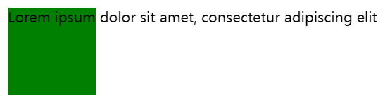

# HTML 元素的不同 width 属性

## scrollWidth

以下为 MDN 的描述：

`Element.scrollWidth` 这个只读属性是元素内容宽度的一种度量，包括由于 `overflow` 溢出而在屏幕上不可见的内容。

`scrollWidth` 值等于元素在没有水平滚动条的情况下，适应视口中的所有内容所需的最小宽度。

测量方式与 `clientWidth` 相同：它包含元素的内边距（padding），但不包括边框，外边距或垂直滚动条（如果有的话）。它还可以包括伪元素的宽度，例如 `::before` 或 `::after` 。

如果元素的内容可以适应其容器而不需要水平滚动条，则其 `scrollWidth` 等于 `clientWidth`

来自 MDN 的两个备注：

> 1. 这个属性会进行四舍五入并返回整数，如果需要小数形式的值，用`element.getBoundingClientRect()`
> 2. 在实际测试过程中，Chrome 获取的 `Element.scrollWidth` 和 IE，Firefox 下获取的 `Element.scrollWidth` 并不相同

### overflow 场景

scrollWidth 与 clientWidth 仅会在 overflow 场景下出现不同，如下例所示：
```html
<div id="container">
Lorem ipsum dolor sit amet, consectetur adipiscing elit
</div>
```
```css
#container {
  width: 100px;
  height: 100px;
  background-color: green;
  white-space: nowrap; /* 为了横向不换行而突出容器宽度 */
}
```



此时三种 width 数值如下：
```
clientWidth 100
scrollWidth 420
offsetWidth 100
```

增加 `overflow: auto` 属性后，按照默认的 `box-sizing: content-box` 并不会有任何变化，以上三个 width 不变，而元素会多一个横向滚动条。

这时再设置 `box-sizing: border-box` 后，变化如下：


TODO:

## clientWidth

以下为 MDN 的描述：

只读属性` Element.clientWidth` 对于内联元素以及没有 CSS 样式的元素为 0。除此之外，它的宽度是元素内部的宽度（单位为 px）。

该属性包括内边距（padding），但不包括边框（border）、外边距（margin）和垂直滚动条（如果有的话）。

同样地，这个值会被四舍五入成整数，如果需要小数，可以用 `element.getBoundingClientRect()`


注意上图的 clientWidth 不包括滚动条。

在没有 border 的情况下，clientWidth 就是元素的 width，而有 border 的情况下，计算方式就变成了：

`clientWidth` = `width` - `border`

## offsetWidth

以下为 MDN 的描述：

`HTMLElement.offsetWidth` 是一个只读属性，返回一个元素的布局宽度。

offsetWidth 包含元素的边框 (border)、水平方向上的内边距 (padding)、竖直方向滚动条 (scrollbar)（如果有的话）、以及 CSS 设置的宽度 (width) 的值。

如下图所示：


offsetWidth 在 `box-sizing: border` ，也就是 `border-box` （IE 盒模型）时，就等于元素的 width。参见 [Box Model](../css/Box_Model.md)。

而在标准盒模型，也就是 `box-sizing: content` 时，offsetWidth 的计算方式如下：

`offsetWidth` = `width` + `border` + `padding`