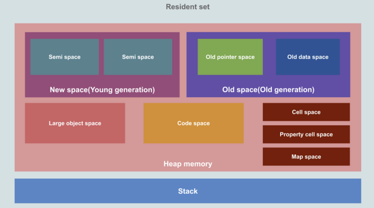

# JavaScript基础 - 垃圾回收

## 标记清理

1. 变量进入上下文，也可理解为作用域，会加上标记，证明其存在于该上下文；
2. 将所有在上下文中的变量以及上下文中被访问引用的变量标记去掉，表明这些变量活跃有用；
3. 在此之后再被加上标记的变量标记为准备删除的变量，因为上下文中的变量已经无法访问它们；
4. 执行内存清理，销毁带标记的所有非活跃值并回收之前被占用的内存；

### 局限
- 由于是从根对象(全局对象)开始查找，对于那些无法从根对象查询到的对象都将被清除
- 回收后会形成内存碎片，影响后面申请大的连续内存空间

## 引用计数
引用计数策略相对而言不常用，因为弊端较多。

其思路是对每个值记录它被引用的次数，通过最后对次数的判断(引用数为0)来决定是否保留，具体的规则有

1. 声明一个变量，赋予它一个引用值时，计数+1；
2. 同一个值被赋予另外一个变量时，引用+1；
3. 保存对该值引用的变量被其他值覆盖，引用-1；
4. 引用为0，回收内存；

### 局限
循环引用导致永远无法被回收

## 内存泄露

意外声明全局变量
```js
function hello() {
  name = 'tom'
}
hello();
```
未声明的对象会被绑定在全局对象上，就算不被使用了，也不会被回收，所以写代码的时候，一定要记得声明变量。

定时器
```js
let name = 'Tom';
setInterval(() => {
  console.log(name);
}, 100);
```
定时器的回调通过闭包引用了外部变量，如果定时器不清除，name会一直占用着内存，所以用定时器的时候最好明白自己需要哪些变量，检查定时器内部的变量，另外如果不用定时器了，记得及时清除定时器。

闭包
```js
let out = function() {
  let name = 'Tom';
  return function() {
    console.log(name);
  }
}
```
由于闭包会常驻内存，在这个例子中，如果out一直存在，name就一直不会被清理，如果name值很大的时候，就会造成比较严重的内存泄漏。所以一定要慎重使用闭包。

事件监听
```js
mounted() {
  window.addEventListener("resize",  () => {
    //do something
  });
}
```
在页面初始化时绑定了事件监听，但是在页面离开的时候未清除事监听，就会导致内存泄漏。

## V8 引擎的内存管理
V8采用了分代回收的策略，将内存分为两个生代：新生代和老生代

### V8 的堆的构成


- 新生代（New Space/Young Generation）： 大多数新生对象被分配到这，分为两块空间，整体占据小块空间，垃圾回收的频率较高，采用的回收算法为 Scavenge 算法

- 老生代（Old Space/Old Generation）：大多数在新生区存活一段时间后的对象会转移至此，采用的回收算法为 标记清除 & 整理（Mark-Sweep & Mark-Compact，Major GC） 算法，内部再细分为两个空间
  - 指针空间（Old pointer space）: 存储的对象含有指向其他对象的指针
  - 数据空间（Old data space）：存储的对象仅包含数据，无指向其他对象的指针

- 大对象空间（Large Object Space）：存放超过其他空间（Space）限制的大对象，垃圾回收器从不移动此空间中的对象

- 代码空间（Code Space）: 代码对象，用于存放代码段，是唯一拥有执行权限的内存空间，需要注意的是如果代码对象太大而被移入大对象空间，这个代码对象在大对象空间内也是拥有执行权限的，但不能因此说大对象空间也有执行权限

- Cell空间、属性空间、Map空间 （Cell ,Property,Map Space）： 这些区域存放Cell、属性Cell和Map，每个空间因为都是存放相同大小的元素，因此内存结构很简单。

### 新生代
新生代内存中的垃圾回收主要通过 Scavenge 算法进行，具体实现时主要采用了 Cheney 算法。

新生代的堆内存被分为多个Semispace，每个Semispace分为两部分from和to，只有from的空间是使用中的，分配对象空间时，只在from中进行分配，to是闲置的。

进行垃圾回收时按照如下步骤进行：
1. 找出from中还在使用的对象，即存活的对象
2. 将这些活着的对象全部复制到to
3. 反转from和to，这时候from中全部是存活对象，to全部是死亡对象
4. 对to进行全部回收

在新生代中我们复制的是存活的对象，死亡对象都留在原地，最后被全部回收。

这是因为对于大多数新增变量来说，可能只是用一下，很快就需要释放，那在新生代中每次回收会发现存活的是少数，死亡的是多数。那我们复制的就是少数对象，这样效率更高。如果一个变量在新生代中经过几次复制还活着，那他生命周期可能就比较长，会晋升到老生代。

有两种情况会对对象进行晋升：
1. 新生代垃圾回收过程中，当一个对象经过多次复制后还存活，移动到老生代；
2. 在from和to进行反转的过程中，如果to空间的使用量超过了25%，那么from的对象全部晋升到老生代

### 老生代
老生代存放的是生命周期较长的对象，他的结构是一个连续的结构，不像新生代分为from和to两部分。老生代垃圾回收有两种方式，**标记清除**和**标记合并**。

- 标记清除：标记清除是标记死亡的对象，直接其空间释放掉。
  
在标记清除方法清除掉死亡对象后，内存空间就变成不连续的了，所以出现了另一个方案：标记合并。

- 标记合并：这个方案有点像新生代的Cheney算法，将存活的对象移动到一边，将需要被回收的对象移动到另一边，然后对需要被回收的对象区域进行整体的垃圾回收。

与新生代算法相比，老生代主要操作死亡对象，因为老生代都是生命周期较长的对象，每次回收死亡的比较少；而新生代主要操作的存活对象，因为新生代都是生命周期较短的对象，每次回收存活的较少。这样无论新生代还是老生代，每次回收时都尽可能操作更少的对象，效率就提高了。

## 引用
- [一起来看Javascript的垃圾回收机制](https://segmentfault.com/a/1190000038175558)
