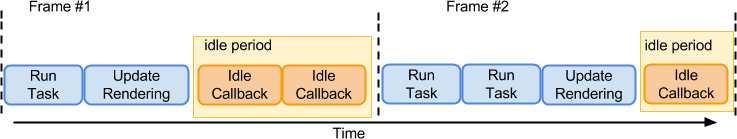

# requestIdleCallback
`window.requestIdleCallback()` 方法插入一个函数，这个函数将在浏览器空闲时期被调用。这使开发者能够在主事件循环上执行后台和低优先级工作，而不会影响延迟关键事件，如动画和输入响应。

函数一般会按先进先调用的顺序执行，然而，如果回调函数指定了执行超时时间timeout，则有可能为了在超时前执行函数而打乱执行顺序。

## 空闲时间
按60Hz的屏幕来算，一帧的间隔时间应该为16ms，而在这16ms的间隔中，从第一帧渲染完成到第二帧渲染开始之间的间隔就是所谓的空闲时间。如下图所示：


还有一种情况，当屏幕上没有任何动画且用户也没有交互时，此时空闲时间可以看作无限长，但实际上为了不在有动作时发生阻塞，应该限制最长空闲时间（比如50ms）。

在空闲期间，callback的执行顺序是以FIFO（先进先出）的顺序。但是如果在空闲时间内依次执行callback时，有一个callback已经将空闲时间用完了，剩下的callback将会在下一次的空闲时间执行。

若当前任务耗时超过了空闲时间，则任务会被带到下一个空闲时间，排到队列末尾执行。

## 用法
```js
let handle = window.requestIdleCallback(callback [, options]);
```
返回一个唯一ID，可以用`cancelIdleCallback`来取消任务

- callback：一个在事件循环空闲时即将被调用的函数的引用。函数会接收到一个名为 IdleDeadline 的参数，这个参数可以获取当前空闲时间，以及回调是否在超时时间前已经执行的状态。
- options（可选）：包括可选的配置参数。具有如下属性：
  - timeout：如果指定了 timeout，并且有一个正值，而回调在 timeout 毫秒过后还没有被调用，那么回调任务将放入事件循环中排队，即使这样做有可能对性能产生负面影响。

### 实现打点
不使用 requestIdleCallback 直接上报数据的话会卡死主线程。

```html
<body>
    <input type="text" id="text" />
</body>
<script>
    const data = []
    const text = document.getElementById('text')
    let isReporting = false

    function sleep(ms = 100) {
        let sleepSwitch = true
        let s = Date.now()
        while (sleepSwitch) {
            if (Date.now() - s > ms) {
                sleepSwitch = false
            }
        } 
    }

    function handleClick() {
        data.push({
            date: Date.now()
        })
        // 监听用户响应的函数，需要花费150ms
        sleep(150)
        handleDataReport()
    }

    function handleDataReport() {
        if (isReporting) {
            return
        }
        isReporting = true
        requestIdleCallback(report)
    }

    function report(deadline) {
        isReporting = false
        while (deadline.timeRemaining() > 0 && data.length > 0) {
            get(data.pop())
        }
        if (data.length) {
            handleDataReport()
        }
    }

    function get(data) {
        // 数据上报的函数，需要花费20ms
        sleep(20)
        console.log(`~~~ 数据上报 ~~~: ${data.date}`)
    }

    text.oninput = handleClick
</script>
```

## 退化到 setTimeout 实现
```js
window.requestIdleCallback = window.requestIdleCallback || function(handler) {
  let startTime = Date.now();

  return setTimeout(function() {
    handler({
      didTimeout: false,
      timeRemaining: function() {
        return Math.max(0, 50.0 - (Date.now() - startTime));
      }
    });
  }, 1);
}
```

## 不适合的场景
一些低优先级的任务可使用 requestIdleCallback 等浏览器不忙的时候来执行，同时因为时间有限，它所执行的任务应该尽量是能够量化，细分的微任务（micro task）。

因为它发生在一帧的最后，此时页面布局已经完成，所以不建议在 requestIdleCallback 里再操作 DOM，这样会导致页面再次重绘。DOM 操作建议在 rAF 中进行。

同时，操作 DOM 所需要的耗时是不确定的，因为会导致重新计算布局和视图的绘制，所以这类操作不具备可预测性。

Promise 也不建议在这里面进行，因为 Promise 的回调属性 Event loop 中优先级较高的一种微任务，会在 requestIdleCallback 结束时立即执行，不管此时是否还有富余的时间，这样有很大可能会让一帧超过 16 ms。
