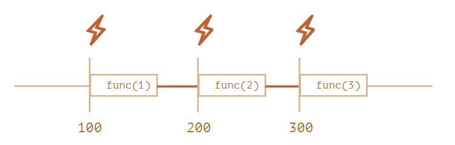
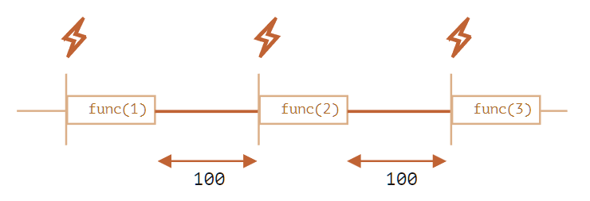

# setTimeout 对比 setInterval
## setTimeout
setTimeout() 方法设置一个定时器，该定时器在定时器到期后执行一个函数或指定的一段代码。

返回值是一个正整数，表示定时器的编号。这个值可以传递给 clearTimeout() 来取消该定时器。

### this 指向
由 setTimeout() 调用的代码运行在与所在函数完全分离的执行环境上。这会导致，这些代码中包含的 this 关键字在非严格模式会指向 window (或全局) 对象，严格模式下为  undefined。

### 实际延迟比设定更久
在浏览器中，setTimeout()/setInterval() 的每调用一次定时器的最小间隔是 4ms，这通常是由于函数嵌套导致（嵌套层级达到一定深度），或者是由于已经执行的 setInterval 的回调函数阻塞导致的

### “期望”延迟
setTimeout 设置的延迟只是“期望”中的执行延迟，由于JS的单线程特性，在延迟时间达到的时刻不一定能按时执行。

### 零延迟的 setTimeout
对于不传入延迟或者传入 0 延迟的 setTimeout 调用，由于事件循环机制，实际上会在所有同步任务和微任务之后再运行。

而且由于HTML的标准规定，在调用5次嵌套的计时器后，计时器最小间隔会被强制定为 4 毫秒。

> Timers can be nested; after five such nested timers, however, the interval is forced to be at least four milliseconds.
> 
> [HTML Standard - 8.6 Timers](https://html.spec.whatwg.org/multipage/timers-and-user-prompts.html#timers)

下例引用自 javascript.info 
```js
let start = Date.now();
let times = [];

setTimeout(function run() {
  times.push(Date.now() - start); // remember delay from the previous call

  if (start + 100 < Date.now()) alert(times); // show the delays after 100ms
  else setTimeout(run); // else re-schedule
});

// an example of the output:
// 1,1,1,1,9,15,20,24,30,35,40,45,50,55,59,64,70,75,80,85,90,95,100
```


## setInterval
setInterval() 方法重复调用一个函数或执行一个代码片段，在每次调用之间具有固定的时间间隔。 同样的也会返回一个正整数值代表定时器编号，传入 clearTimeout() 可以取消定时。

> setInterval() 和 setTimeout() 返回的编号共用同一个编号池，因此实际上清除定时器的两个方法可以混用，当然最好别这么用。


### 延迟问题
如果代码执行时间比定时器时间间隔要长，可能会出现结果不按顺序返回的情况，这时候应该放弃 setInterval 使用 递归形式的 setTimeout，如下所示
```js
(function loop(){
   setTimeout(function() {
      // Your logic here
      loop();
  }, delay);
})();
```

setInterval 对比递归 setTimeout 如下图所示

setInterval 只保证调用起始时间的间隔


递归setTimeout 保证两次运行的间隔



## 参考
- [Scheduling: setTimeout and setInterval](https://javascript.info/settimeout-setinterval)
