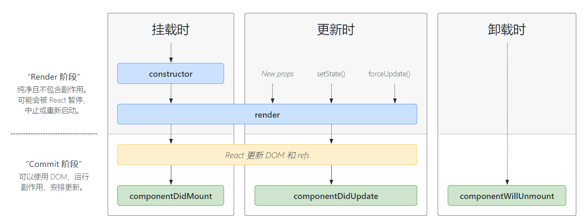

# React 生命周期
## 挂载
当组件实例被创建并插入 DOM 中时，其生命周期调用顺序如下：

- `constructor()`
- `static getDerivedStateFromProps()`
- `render()`
- `componentDidMount()`

## 更新
当组件的 props 或 state 发生变化时会触发更新。组件更新的生命周期调用顺序如下：

- `static getDerivedStateFromProps()`
- `shouldComponentUpdate()`
- `render()`
- `getSnapshotBeforeUpdate()`
- `componentDidUpdate()`

## 卸载
当组件从 DOM 中移除时会调用如下方法：
`componentWillUnmount()`

## 错误处理
当渲染过程，生命周期，或子组件的构造函数中抛出错误时，会调用如下方法：

- `static getDerivedStateFromError()`
- `componentDidCatch()`

## 生命周期图示


## 常见生命周期方法
### render()

render() 方法是 class 组件中唯一必须实现的方法。

当 render 被调用时，它会检查 this.props 和 this.state 的变化并返回以下类型之一：

- React 元素。通常通过 JSX 创建。例如，`<div />` 会被 React 渲染为 DOM 节点，`<MyComponent />` 会被 React 渲染为自定义组件，无论是 `<div />` 还是 `<MyComponent />` 均为 React 元素。
- 数组或 fragments。 使得 render 方法可以返回多个元素。
- Portals。可以渲染子节点到不同的 DOM 子树中。
- 字符串或数值类型。它们在 DOM 中会被渲染为文本节点。
- 布尔类型或 null。什么都不渲染。（主要用于支持返回 `test && <Child />` 的模式，其中 test 为布尔类型。)

render() 函数应该为纯函数，这意味着在不修改组件 state 的情况下，每次调用时都返回相同的结果，并且它不会直接与浏览器交互。

### constructor()
如果不初始化 state 或不进行方法绑定，则不需要为 React 组件实现构造函数。

在 React 组件挂载之前，会调用它的构造函数。在为 React.Component 子类实现构造函数时，应在其他语句之前调用 super(props)。否则，this.props 在构造函数中可能会出现未定义的 bug。

通常，在 React 中，构造函数仅用于以下两种情况：
- 通过给 this.state 赋值对象来初始化内部 state。
- 为事件处理函数绑定实例

> 在 constructor() 函数中不要调用 `setState()` 方法。如果你的组件需要使用内部 state，请直接在构造函数中为 `this.state` 赋值初始 state：

```js
constructor(props) {
  super(props);
  // 不要在这里调用 this.setState()
  this.state = { counter: 0 };
  this.handleClick = this.handleClick.bind(this);
}
```
只能在构造函数中直接为 this.state 赋值。如需在其他方法中赋值，你应使用 this.setState() 替代。

要避免在构造函数中引入任何副作用或订阅。如遇到此场景，请将对应的操作放置在 componentDidMount 中。

### componentDidMount()
componentDidMount() 会在组件挂载后（插入 DOM 树中）立即调用。依赖于 DOM 节点的初始化应该放在这里。如需通过网络请求获取数据，此处是实例化请求的好地方。

这个方法是比较适合添加订阅的地方。如果添加了订阅，应在 componentWillUnmount() 里取消订阅

可以在 componentDidMount() 里直接调用 setState()。它将触发额外渲染，但此渲染会发生在浏览器更新屏幕之前。

### componentDidUpdate()
用法如下：
```js
componentDidUpdate(prevProps, prevState, snapshot)
```

componentDidUpdate() 会在更新后会被立即调用。**首次渲染不会执行此方法**

当组件更新后，可以在此处对 DOM 进行操作。如果你对更新前后的 props 进行了比较，也可以选择在此处进行网络请求。（例如，当 props 未发生变化时，则不会执行网络请求）。

用法示例：
```js
componentDidUpdate(prevProps) {
  // 典型用法（不要忘记比较 props）：
  if (this.props.userID !== prevProps.userID) {
    this.fetchData(this.props.userID);
  }
}
```

也可以在 componentDidUpdate() 中直接调用 setState()，但请注意它必须被包裹在一个条件语句里，正如上述的例子那样进行处理，否则会导致死循环。

它还会导致额外的重新渲染，虽然用户不可见，但会影响组件性能。不要将 props “镜像”给 state，请考虑直接使用 props。

如果组件实现了 getSnapshotBeforeUpdate() 生命周期（不常用），则它的返回值将作为 componentDidUpdate() 的第三个参数 “snapshot” 参数传递。否则此参数将为 undefined。

### componentWillUnmount()
componentWillUnmount() 会在组件卸载及销毁之前直接调用。在此方法中执行必要的清理操作，例如，清除 timer，取消网络请求或清除在 componentDidMount() 中创建的订阅等。

componentWillUnmount() 中不应调用 setState()，因为该组件将永远不会重新渲染。组件实例卸载后，将永远不会再挂载它。
